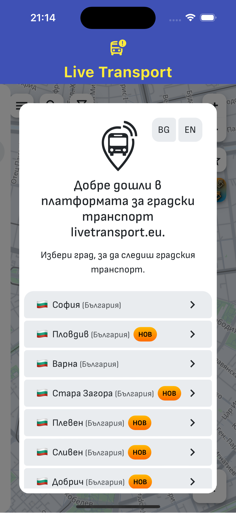
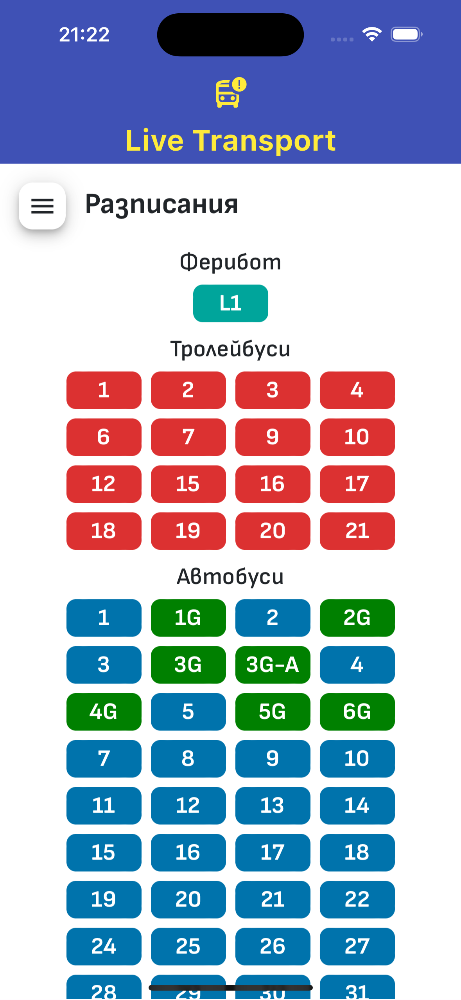
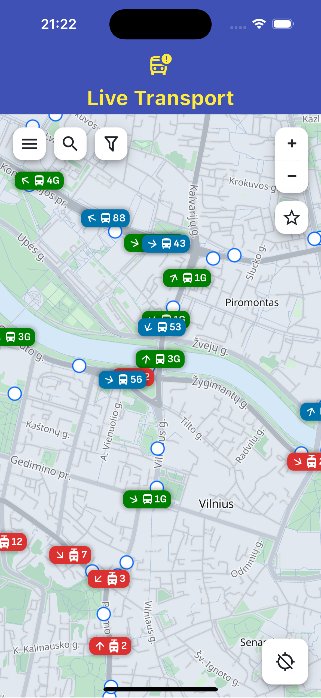
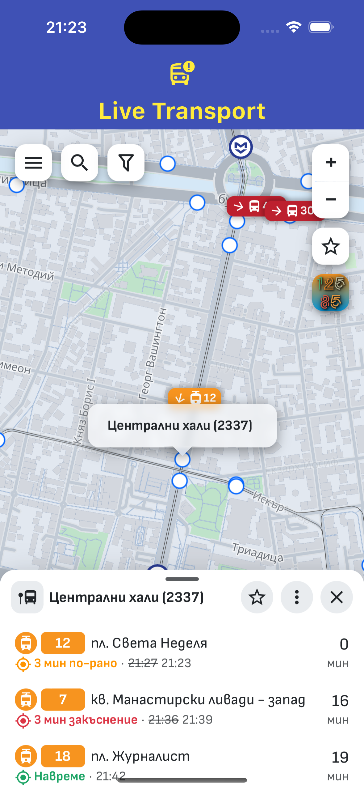

# Live Transport

A Flutter project using WebviewController to embed a web page into a mobile application, aiming to facilitate access to information and save time spent searching in web browsers.

---

## Screenshots

| | |
| :---: | :---: |
|  |  |
|  |  |

---

## About Project

An application built with Flutter that runs on both iOS and Android mobile devices, as well as on emulators during development. It utilizes a WebView to embed the web page's JavaScript code into the mobile application. 
In this case, the application uses the livetransport.eu website, which provides real-time information on the location of public transport vehicles.
